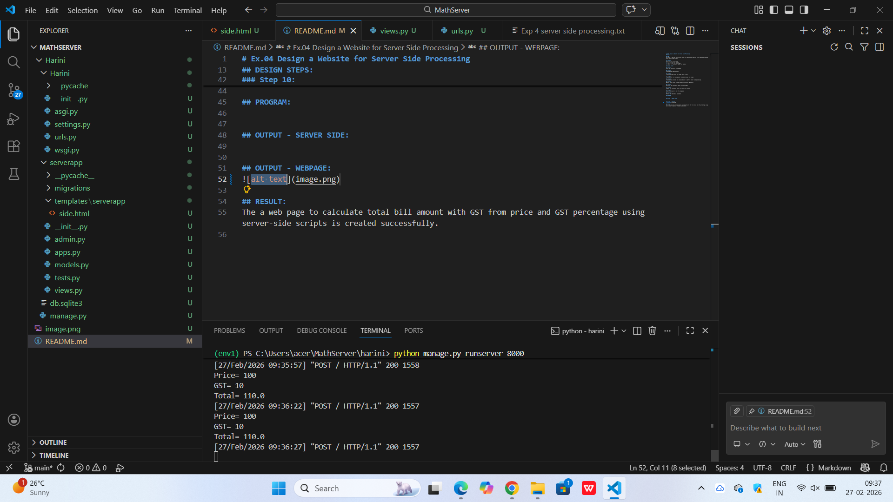
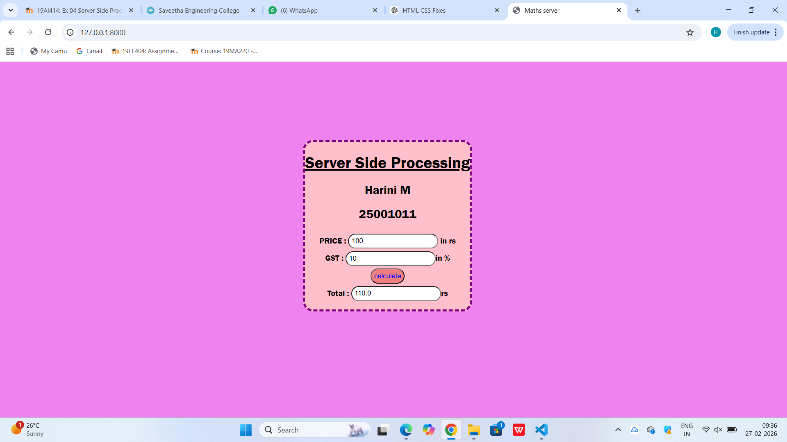

# Ex.04 Design a Website for Server Side Processing
## Date:27.02.2026

## AIM:
To create a web page to calculate total bill amount with GST from price and GST percentage using server-side scripts.

## FORMULA:
Bill = P + (P * GST / 100)
<br> P --> Price (in Rupees)
<br> GST --> GST (in Percentage)
<br> Bill --> Total Bill Amount (in Rupees)

## DESIGN STEPS:

### Step 1:
Clone the repository from GitHub.

### Step 2:
Create Django Admin project.

### Step 3:
Create a New App under the Django Admin project.

### Step 4:
Create a HTML file to implement form based input and output.

### Step 5:
Create python programs for views and urls to perform server side processing.

### Step 6:
Receive input values from the form using request.POST.get().

### Step 7:
Calculate the total bill amount (including GST).

### Step 8:
Display the calculated result in the server console.

### Step 9:
Render the result to the HTML template.

### Step 10:
Publish the website in Localhost.

## PROGRAM:
```
<html>
<head>
    <title>Maths server</title>
</head>
<style>
    .head{
            gap:30;
            position: absolute;
            top:22%;
            right: 40%;
            border: dashed  4px purple;
            border-radius: 20px;
            background: pink;
        }
         input {
            margin-top: 5px;
            padding: 5px;
            border-radius: 20px;
        }
        body {
            font-family: 'Franklin Gothic Medium', 'Arial Narrow', Arial, sans-serif;
            background-color: violet;
        }
        form {
            border-radius: 20px;
            width: 300px;
        }
        .submit{
            color: blue;
            background-color: lightcoral;
        }
</style>
<body>
    <center>
    <div class="head">
                <h1><u>Server Side Processing</u></h1>
                <h2>Harini M</h2>
                <h2>25001011</h2>
    <form method="post">
        
        <div>
        PRICE : <input type="text"  name="Price"  value="{{p}}" required></input> in rs
        <br>
        </div>
        <div>
        GST : <input type="text"  name="GST" value="{{GST}}" required></input>in %
        <br>
        </div>
        <div>
        <input class="submit" type="submit" value="calculate">
        </div>
        <div>
        Total : <input type="text" name="Total" value="{{total}}"></input>rs
        <br>
        </div>  
    </form>
    
    </center>
</body>
</html>


views.py

from django.shortcuts import render
def calculate_total(request):
	P=int(request.POST.get('Price',0))
	GST=int(request.POST.get('GST',0))
	total= P + (P *GST/100) if request.method=="POST" else 0
	print("Price=",P)
	print("GST=",GST)
	print("Total=",total)
	return render(request,'serverapp/side.html',{'P':P,'GST':GST,'total':total})

    urls.py
    from django.contrib import admin
from django.urls import path
from serverapp import views

urlpatterns = [
    path('', views.calculate_total, name='Total')
]

```

## OUTPUT - SERVER SIDE:


## OUTPUT - WEBPAGE:


## RESULT:
The a web page to calculate total bill amount with GST from price and GST percentage using server-side scripts is created successfully.
